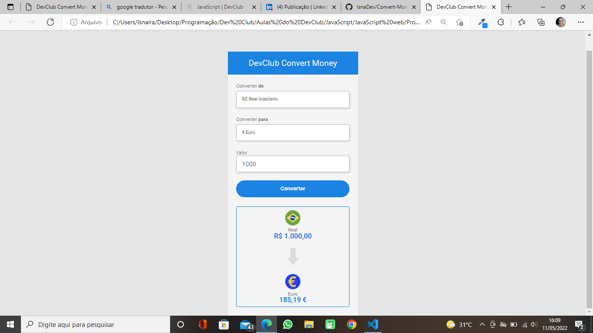

# Convert-Money
Currency converter taught in DevClub classes

 
 
 

> Project carried out in JavaScript class using HTML, CSS and JavaScript. In it can be carried out the converção of the Real for the Dollar, the Hard and the Bitcoin.

## 🤝👩🏻 Collaborator

<table>
  <tr>
    <td align="center">
      <a href="#">
         
        
          <b>Isnaíra Souza</b>
        
      </a>
    </td>
    
</table>

[⬆ Voltar ao topo](#Convert-Money) 